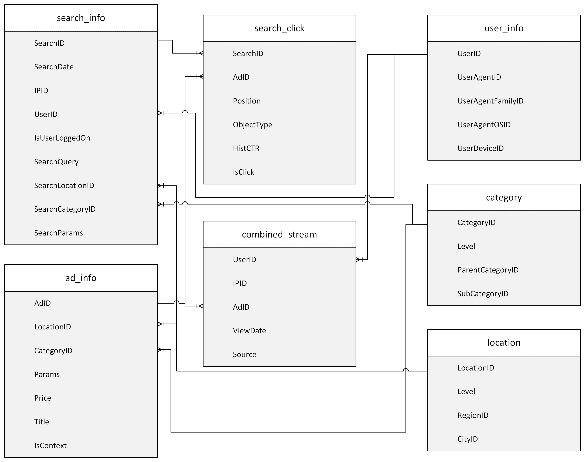
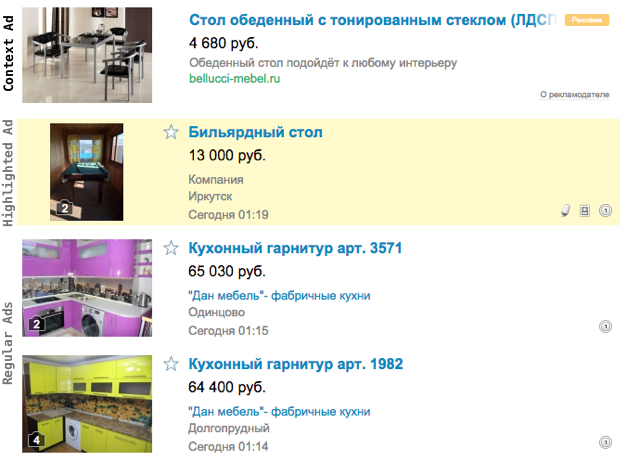
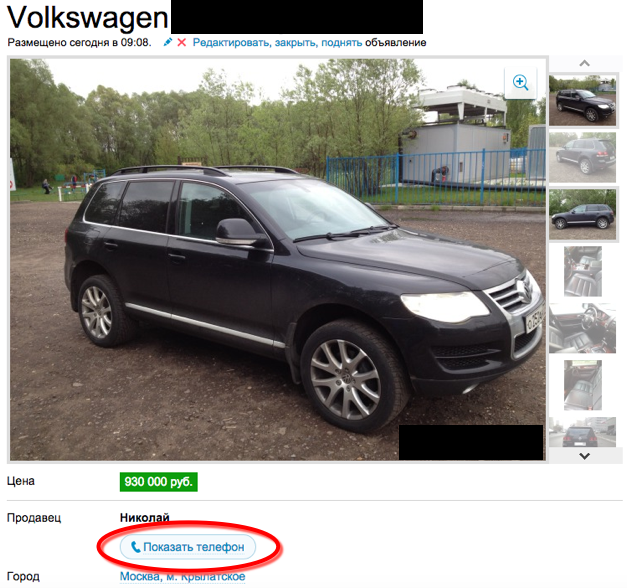

# Big Data Project

The goal of the project is to identify one or more question of interest based on a large dataset to produce an interesting result. You are welcome to use any combination of the tools we learned in class, or any cloud platform. You are also welcome to use other tools/techniques not specifically learned in class, as long as using them is is **in addition to** and not instead of the tools learned in class.

## Dataset Description and Location

### Location

The data files are located in both AWS and Azure

* AWS: `s3://bigdatateaching/project-data/`
* Azure: `wasbs://public@bigdatateaching.blob.core.windows.net`

The dataset was extracted from an online advertising company's systems. Here is [Entity Relation Diagram](https://en.wikipedia.org/wiki/Entity%E2%80%93relationship_model) of the data. The data is provided in _tab-delimited files_.

### `search_click`

`search_click` is a random sample of previously selected users' searches on the platform during at least 16 consecutive days from April 25 2015 until the target impression. Different types of ads on the site are shown in the picture below:

Regular ads are shifted down constantly as new ads come in. (Normally, a visitor's search results are sorted by the time an ad is submitted to the platform). Each line in the file describes one "impression" (an ad that is shown to a particular user based on a search). 

| Field Name | Description |
|------------|---------------
| SearchID | Identifier for a visitors's search event |
| AdID | Identifier of the ad (see also ad description in `ad_info`).
| Position | position of the ad in search result page (1 - is first ad on a page starting from the top). Only ads on position 1, 2, 6, 7, and 8 are logged.
| ObjectType | Type of the ad shown to user. The options are: `1` - regular free ads added by users; `2` - highlighted regular (owners have to pay fixed price to highlight them and stick to the top for some period of time); `3` - contextual ads (owners have to pay per visitor's click).
| HistCTR | Some naive history-based estimation of click-through rate for contextual ads, calculated when the ad is showed. For non-contextual ads this field equals NULL.
| IsClick | `1` if there was a click on this ad. Otherwise `0`. For non-contextual ads this field equals NULL. The goal of this competition is to make a click prediction model for contextual ads.

### `combined_stream`

These are samples of users' visits to non-contextual ad landing pages and the corresponding phone request (if one occurred). Each ad's landing page shows the hidden seller's phone number. To be able to contact the seller, the user needs to click the request phone button:

Consequently, a user's phone request event could be considered a proxy for a user's response to the advertisement. We believe that clicking the phone request indicates a high level of interest in the ad.

| Field Name | Description |
|------------|---------------
| UserID | Anonymized identifier of visitor's cookie (see also `user_info`).
| IPID | Anonymized identifier of visitor's IP.
| AdID | Identity of the ad's landing page visited by user (see also `ad_info`).
| ViewDate | Date and time of viewing the ad
| Source | Whether the view was from a site visit or phone

### `search_info`

| Field Name | Description |
|------------|---------------
| SearchID | Identifier of search event.
| SearchDate | Date and time of the search event.
| UserID | Anonymized identifier of visitor's cookie.
| IsUserLoggedOn | Whether user was logged on with his/hers login (1) or not (0).
| IPID | Anonymized identifier of visitor's IP.
| SearchQuery | Raw query text if it was specified while search. NULL otherwise.
| SearchLocationID | Identifier of the location where search was made (see also `location`).
| SearchCategoryID | Category filter of the search (see also `category`).
| SearchParams | Dictionary-like structure with optional filters of the search if they were specified while search. `NULL` otherwise.

### `ad_info`

| Field Name | Description |
|------------|---------------
| AdID | Identity of an ad.
| LocationID | Ad's geo-targeting. (references `location` for regular ads). NULL for contextual ads.
| CategoryID | Ad's category according to the classification model. (references `category`)
| Params | Parameters for the context ad in dictionary-like format. NULL for some ads (where no parameters are available).
| Price | Price for an ad
| Title | Raw title text.

**Note:** `Params` from `ad_info` and `SearchParams` from `search_info` share same dictionary (keys and values). The Params are semi-structured to reflect the nature of the search and the product. For example, the Params for clothing might be gender, size, color, brand; while the Params for houses might be size, # of bedrooms, # of bathrooms, etc.

### `user_info`

| Field Name | Description |
|------------|---------------
| UserID | Anonymized identifier of visitor's cookie.
| UserAgentID | Anonymized identifier of user's browser.
| UserAgentFamilyID | Anonymized identifier of user's browser family (Chrome, | Safari, etc).
| UserAgentOSID | Anonymized identifier of user's OS derived from browser family.
| UserDeviceID | Anonymized identifier of user device type and model (Samsung GT-I9500, iPhone, etc.)

### `location` 

| Field Name | Description |
|------------|---------------
| LocationID | Identifier of the location.
| Level | Level of search/impression (3 = city, 2 = region, 1 = country)
| RegionID | Identifier of the search/impression region.
| CityID | Identifier of the search/impression city.

### `category`

| Field Name | Description |
|------------|---------------
| CategoryID | Identifier of the category.
| Level | Level of category for search/impression/ad (3 = subcategory, 2 = category, 1 = total)
| ParentCategoryID | Identifier of parent category.
| SubcategoryID | Identifier of subcategory that has parent category.

Note that some users from `search_click` may not have any historical information in `combined_stream`.

## Tasks

While the project is open ended, there are some parameters and guidelines to help plan and organize your approach. The project needs to have, at a minimum, the following:

* **Exploratory Analysis:** Explore, assess and visualize the data. Aggregate, count, and summarize. Create graphs, tables, etc., and explain your findings in writing. Clean data as needed and build an analytical dataset. 
* **Model:** Build any model you feel is appropriate and meaningful. You can use supervised and/or unsupervised approach. You must have evaluation metrics for supervised approaches and/or visualizations for unsupervised learning approaches. You are welcome to try different modeling techniques that you are comfortable with. 

## Writeup & Code Files

You will submit a final writeup of your project along with the code files via GitHub. The README file is your writeup, and all. There is no minimum or maximum length requirement. We prefer simple and terse writing over long and verbose. Bullets are fine, however, you still need to have a full writeup. As long as what your writeup covers what you want to convey, it's OK. The writeup needs to have the following sections:

- Executive Summary
- Methods section, which provides details on the following:
    - How you sourced, ingested, cleansed, prepared the dataset with samples of intermediate data
    - Tools you used for analyzing the dataset and the justification (tools, models, etc.)
    - How did you model the dataset, what techniques did you use and why?
    - Did you have a hypothesis that you were trying to prove?
    - Did you just visualize the dataset, and if so, why?
- Challenges (technical & non-technical) and how you overcame them
- Results/Conclusions section:
    - What did you find and learn?
    - How did you validate your results? 
- Future work: what would you do differently and what follow-up work would you do? Would you use other tools?
- Takeaways from the course
- Code files (you should list your code files here, and these must be in your submitted repository with appropriate comments.)

### Advice

This is a snippet from a chapter that Prof. Vaisman wrote for the [Bad Data Handbook](http://shop.oreilly.com/product/0636920024422.do) which I hope provides some guidance.

_There are many kind of analytical exercises you can do. Some begin as an exploration without a specific question in mind; but it could be argued that even when exploring, there are some questions in mind that are not formulated. Other exercises begin with a specific question in mind, and end up answering another question. Regardless, before you embark on a research investigation, you should have some idea of where you are going. You need to be practical and know when to stop and move onto something else. But again, start with some end in mind. Just because you have a lot of data does not mean you have to do analysis just for analysis’ sake. Very often, this kind of approach ends with wasted time and no results._

## Submitting the Project

You will be getting a blank `README.md` file in your repository when you accept the assignment with GitHub classroom.  

The files to be committed and pushed to the repository for the project are:

* `README.md` which is your project writeup file. 
* Any script/notebook file referenced in the __code__ section of your writeup. We should be able to follow the code with the writeup.
* Do NOT commit data files to the repository,

## Grading Criteria

The project will be graded holistically with the following rubric:

Grade of A:

* Project covers all areas above
* There is discussion on specifics of the analysis, and analysis decisions are justified
* Code is commented and organized
* Language is clear, figures support research/investigation
* Properly formatted, clean presentation and no grammatical errors

Grade of B:

* One major deficiency and/or
* Writeup and/or analysis is missing significant discussion/justification around analysis performed and/or
* Minor flaws in layout/presentation of analysis

Grade of C:

* Two deficient areas and/or
* Major flaws in layout/presentation of analysis

Grade of D:

* Three or more deficient areas

For the purposes of grading, a **deficiency** can mean any of the following:

- Instructions are not followed
- Missing sections of the project
- Poor and sloppy writing and/or presentation, including spelling and grammatical errors
- Code is not documented with comments
- Code files referenced are not in repository
- Absolute links included in repository
- Dataset included in repository
- Missing model performance metrics
- Doing an analysis and/or model just for the sake of doing it, without thinking through and providing analytical justification
